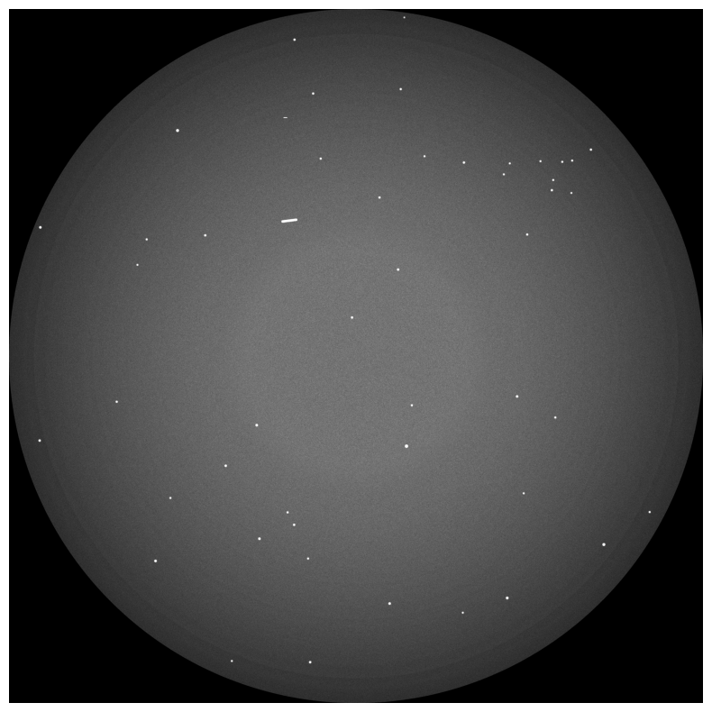
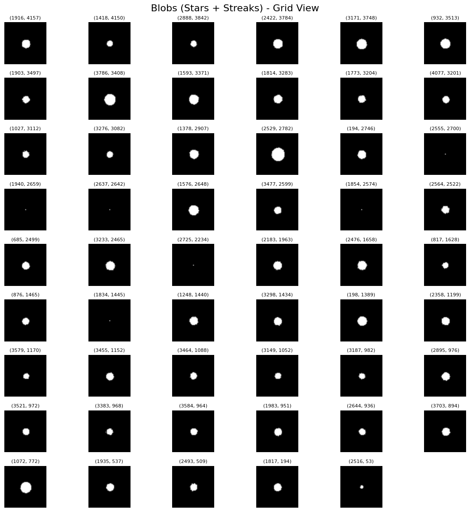
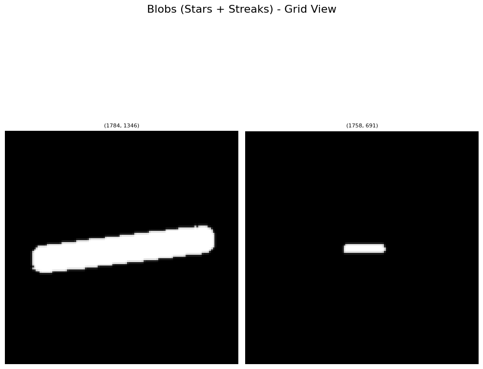

# Asessment by Digantara
## *Detection and Classification of the streaks and stars from telescopic images*
[Problem PDF](./src/problem.pdf)

---
###  Sample Star 

--- 
### Sample Streak 

---
### Answers : 
1. To achieve higher accuracy when there are not enough images available we can use data augmentation which including rotation,  blurring, resizing croping etc. Using it we can generate new images and increase the size of our data.

2. Overfitting can be addressed using the data augmentation. For the underfitting, better preprocessing of the image should be included in the pipeline. The blurring algorithm and constrast redistributing algorithm used to remove noise should ensure sufficient increase in pixel values of stars and streaks. The blob detection parameters should be initialised decisively to reduce the misses in detection process. The major factor contributing in these problems is the facts that the raw images provided have very low constast. Also in the conversion process of 16 bits to 8 bits, the information about the entities is lost, lets say, for example a relative bright star with high pixel value becomes similar to a star with low pixel value when conversion to 8 bits is done. 

3. I believe the images in the dataset provided are some sort of snapshots from the telescope. Model should perform good only if the preprocessing (noise removal) step is done in the right manner ensuring the faint objects are detection before feeding the image to the model. The atmospherical disturbance should also be taken under consideration while preprocessing the image. As far as I know, these steps will help model to improve the its performance.

4. For the given question, the model is yet to be developed. To my best knowledge, itd challenging to generate appropiate error  matrix.

Note : *The work done is not to be considered as completed in any case. Due to time shortage, I'm submitting the partially completed work.*